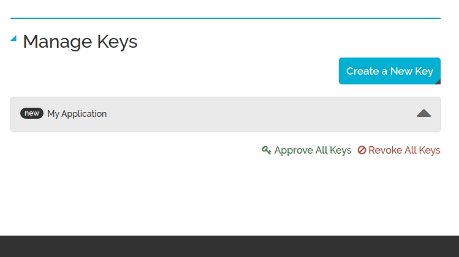

# Trabajos prácticos

# TP 2 - Calculador de rutas con MapQuest

## Condiciones y formato de entrega

Deberán formar sus grupos de 2 personas, clonarse [este repositorio](https://classroom.github.com/g/kuFO9JDD) y trabajar allí. 

Se tomará como entrega el código que esté allí el día **Martes 24 de Marzo a las 23:59 horas**, sin excepciones. Luego de la entrega habrá una defensa individual en clase para validar que todas las personas del grupo hayan aportado al trabajo.

## Criterios de evaluación y calificación

Para **aprobar**, deben cumplir _todos_ los siguientes requisitos:
* que el script cumpla su función (genere las rutas, calcule las estadísticas);
* manejar correctamente los errores que puedan surgir;
* utilizar únicamente los métodos asincrónicos para escribir archivos (no vale `fs.writeFileSync`);
* no dejar computaciones colgadas, es decir: funciones sin callbacks y/o promises sin manejar sus respuestas.

Para **poder promocionar**, deben además implementar correctamente la mayor cantidad de bonus. Ojo con esto: preferimos un programa que funciona y hace menos cosas a uno que pretende hacer un montón de cosas pero no funciona ninguna.

Además, tendremos en cuenta estos criterios de calidad para la construcción de la nota final:
* correcta división en subtareas, ya sea usando funciones o usando clases;
* código repetido;
* legibilidad del código (nombres de variables, funciones, etc.);
* prolijidad;
* puntualidad en la fecha de entrega.

## Configuración del entorno

1. Desde una consola dentro del proyecto, ejecutar `npm install` para instalar las dependencias.
1. Crearse una cuenta en [MapQuest](https://developer.mapquest.com/plan_purchase/steps/business_edition/business_edition_free/register).
1. Obtener la _Consumer Key_ desde la [página de la documentación](https://developer.mapquest.com/user/me/apps) que se abre luego de registrarse (ver GIF más adelante).
1. Agregar la _Consumer Key_ al código y ejecutarlo para verificar que funcione.



## Consignas

El objetivo del trabajo es construir un _script_ en NodeJS que a partir de un archivo de texto con varias direcciones realice las siguientes acciones:
* calcule la ruta para llegar de cada destino al siguiente, utilizando MapQuest;
* genere un archivo de texto por cada ruta, con los pasos para ir desde un lugar al otro;
* (opcional, si hacen los bonus) imprimia por pantalla una serie de estadísticas sobre las rutas y lugares ingresados.

Por ejemplo, si ejecutaramos el programa con estas direcciones:

```
Casullo 1000, Morón, Buenos Aires
Universidad Nacional de Hurlingham
Andrés Lamas 133, Ituzaingó, Buenos Aires
```

Deberíamos obtener como resultado dos archivos: uno para la ruta entre Casullo y la Universidad...
```
Empieza dirigiéndote al norte por Doctor José María Casullo hacia Grant.
Sigue a la derecho para ir a Grant.
Haz un giro  leve a la izquierda en Boulevard Brigadier General Juan Manuel de Rosas.
Boulevard Brigadier General Juan Manuel de Rosas se convierte en RP4/Avenida Gobernador Valentín Vergara.
Haz un giro  a la izquierda en Manuel Origone.
MANUEL ORIGONE 151.
```

y otro para la ruta entre la Universidad y Andrés Lamas...
```
Empieza dirigiéndote al este por Manuel Origone hacia Ausebione.
Haz un giro  a la derecha en RP4/Avenida Gobernador Valentín Vergara.
Haz un giro  a la derecha en Av. Presidente Juan Domingo Perón.
Haz un giro  leve a la izquierda en ramp.
Ingresa en RN7/Acceso Oeste (Peaje por tramos).
Toma la salida.
Ingresa en Av. Presidente Juan Domingo Perón.
Toma la 1ra a la izquierda en Dr. Nicolás Repetto.
Dr. Nicolás Repetto se convierte en Santa Rosa.
Haz un giro  a la derecha en Andrés Lamas.
ANDRéS LAMAS.
```

A muy alto nivel, el programa debería comportarse así:
1. leer el archivo con las direcciones,
1. hacer una _request_ a MapQuest con cada par de direcciones,
1. escribir un archivo por cada _request_, con los pasos que devolvió la API,
1. (para el bonus) computar las estadísticas una vez que terminen todas las _requests_.

## Organización del repositorio

Al descargarse el ejercicio, van a encontrarse con estos archivos:

```
.
├── direcciones.txt
├── index.js
├── lib
│   ├── colores.js
│   └── map_quest.js
├── package.json
├── package-lock.json
├── README.md
├── respuestas
│   ├── lugar.json
│   └── ruta.json
├── rutas
└── test
    └── direccion.js
```

Breve descripción de cada uno:

* `direcciones.txt`: ejemplo de direcciones con las que podrían probar ejectuar el script;
* `index.js`: el _main_, viene con ejemplos de cómo usar la API de MapQuest;
* carpeta `lib`: código que les damos para iniciar:
  * `colores.js`: utilidad para ponerle colores a la salida del script;
  * `map_quest.js`: simplificación de la API de MapQuest para ahorrarles leer la documentación y manejar algunos errores;
* `package.json` y `package-lock.json`: archivos de configuración del proyecto;
* carpeta `respuestas`: ejemplos de las respuestas de la API de MapQuest:
  * `lugar.json`: respuesta de ejemplo para el método `obtenerLugar`;
  * `ruta.json`: respuesta de ejemplo para el método `obtenerRuta`;
* carpeta `rutas`: está vacía, la incluimos para que guarden ahí el resultado del script;
* `test/direccion.js`: script para probar las direcciones, ver detalles en la siguiente sección.
  
## Consejos para la implementación

Largarse a hacer todo de una puede ser un poco abrumante, les recomendamos dividir el problema en varias etapas que ataquen de a una complejidad a la vez. En esta línea, podrían ir haciendo el programa de manera incremental siguiendo los puntos descriptos en el apartado anterior: una primera versión que solo lea dos direcciones e imprima por pantalla, una segunda que ya escriba en un archivo, una tercera que procese todas las direcciones, etc.

Otra recomendación: no mezclen _callbacks_ y _promises_. Elijan una de las dos estrategias y usen solo esa.

Incluimos un archivo `direcciones.txt` con algunas direcciones que pueden usar para probar. Pueden modificarlas o agregar otras, teniendo la precaución de que lo que pongan sea válido - a veces la dirección existe pero no es el lugar que pensaban.

Para evitar sorpresas, les dejamos un script en `test/direccion.js` que sirve para ver si una dirección es válida y apunta a donde quieren. Un ejemplo de esto:

```shell
❯ node test/direccion.js "Av. Vergara 1471"
[MapQuest] Buscando información de Vergara 1471...
¡Dirección válida!
{
  street: 'Vergara 1471',
  adminArea5: 'Vicente López',
  adminArea5Type: 'City',
  ...
}

❯ node test/direccion.js "Av. Vergara 1471, Villa Tesei"
[MapQuest] Buscando información de Av. Vergara 1471, Villa Tesei...
Error: No se encontró la dirección que pusiste. 
Revisá que el formato sea el correcto, por ejemplo: "Av. Rivadavia 15921"

❯ node test/direccion.js "Vergara 1471, Villa Tesei"
[MapQuest] Buscando información de Vergara 1471, Villa Tesei...
¡Dirección válida!
{
  street: 'Avenida Gobernador Valentín Vergara',
  adminArea5: 'Villa Tesei',
  adminArea5Type: 'City',
  ...
}

```

## Bonus

### Información de los lugares

Generar un archivo `lugares.txt` con información adicional de cada una de las direcciones:
* nombre completo de la calle,
* código postal,
* latitud y longitud,
* ciudad, provincia y país.

Toda esta información la obtienen con el método `obtenerLugar` que ya mencionamos. El archivo debería tener tres líneas por cada lugar, con este formato:

```
NOMBRE COMPLETO DE LA CALLE - CÓDIGO POSTAL
Coordenadas: (LATITUD, LONGITUD)
CIUDAD, PROVINCIA, PAIS
```

Por ejemplo, para la primera dirección del ejemplo debería producir esta salida:

```
Doctor José María Casullo - 1708
Coordenadas: (-34.648853, -58.624137)
Morón, Buenos Aires, AR
```

### Estadísticas

Luego de calcular todas las rutas, imprimir por pantalla las siguientes estadísticas:

**De las rutas**
* total de kilómetros recorridos,
* distancia promedio de las rutas,
* ruta más larga: origen, destino y kilómetros,
* ruta más corta: origen, destino y kilómetros.

**De los lugares**
* provincias recorridas (sin repetidos),
* ciudades recorridas (sin repetidos).

Para las estadísticas de los lugares van a necesitar hacer más _requests_, porque necesitan la información de los lugares. Pueden usar para eso el método `obtenerLugar` que les dejamos implementado, en cualquiera de sus dos variantes (_callback_ o _promise_).

**Ayuda**: para esperar a que una lista de promises termine pueden usar [`Promise.all`](https://developer.mozilla.org/es/docs/Web/JavaScript/Referencia/Objetos_globales/Promise/all).

### Mapas

Además de la narrativa, cada maniobra que devuelve la API viene acompañada por una pequeña imagen de un mapa que muestra por dónde estaríamos circulando (está en el atributo `mapUrl`).

La idea de este bonus es que **además** de generar el txt con los pasos para cada ruta, descarguen todas esas imágenes. Quedaría algo así por cada ruta:
* `ruta-0.txt`;
* `ruta-0-maniobra-0.jpg`;
* `ruta-0-maniobra-1.jpg`;
* `ruta-0-maniobra-2.jpg`;
* `ruta-0-maniobra-3.jpg`.
* etcétera...

Si se animan, pueden compilar todas esas imágenes en una sola, algo así como lo que hicieron en el TP 1. Para esto, pueden usar [`node-sprite-generator`](https://www.npmjs.com/package/node-sprite-generator) o cualquier otra biblioteca que encuentren.

## Repositorios de ejemplo

* [Manipulación de archivos](https://github.com/concu-unahur/nodejs-introduccion-promises/blob/master/archivos.js): ejemplo de cómo escribir un archivo.

## Links útiles

* [Documentación de la API de MapQuest](https://developer.mapquest.com/documentation/open/directions-api/)
